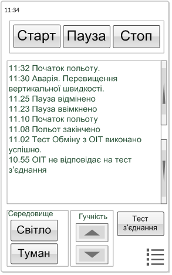

# Flight simulator cockpit control pad
The cockpit control pad is the tool, that allows pilots to do some actions for manage the simulator inside the cockpit without simulator staff and get feedback about simulator states and modes. For example, pilots can restart or set to pause the flight, change some weather conditions and see the cause of accidents right in their seats. This tool is the part of conception of independence that support pilots self-studying abilities and provides decreasing of staff loading. The control pad was constructed on Android platform and mounted on cockpit board behind the pilots.

